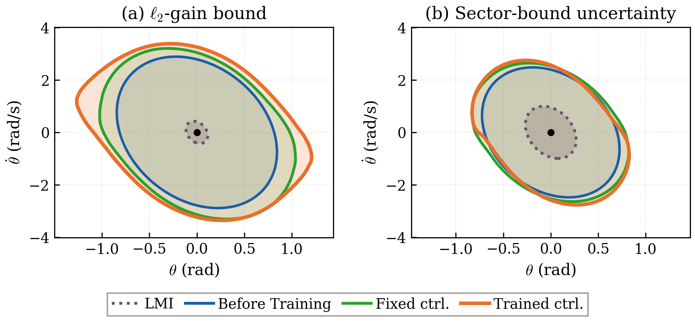

# Learning Neural Network Controllers with Certified Robust Performance

[](https://arxiv.org/abs/2604.01188)
[](LICENSE)

Code for the paper:

> **Learning Neural Network Controllers with Certified Robust Performance via Adversarial Training**
> Neelay Junnarkar, Yasin Sonmez, Murat Arcak
> [arXiv:2604.01188](https://arxiv.org/abs/2604.01188)

We jointly synthesize neural network controllers and dissipativity certificates that formally guarantee robust closed-loop performance. Adversarial training uses counterexamples to the robust dissipativity condition to guide learning, and post-training verification with [α,β-CROWN](https://github.com/Verified-Intelligence/alpha-beta-CROWN) certifies the result. The method handles both exogenous disturbances (ℓ₂-gain) and non-parametric model uncertainty (sector bounds) using quadratic constraints.

<p align="center">
  
</p>

**Figure:** Projections of the certified robust dissipativity regions onto the plant state (θ, θ̇) for the inverted pendulum. **(a)** ℓ₂-gain bound with exogenous disturbance. **(b)** Sector-bound model uncertainty. In both cases, our method (orange) certifies regions significantly larger than the LMI baseline (dashed purple). Training the controller jointly with the certificate (orange) further expands the certified region compared to a fixed controller (green).

---

## Setup

**Requirements:** Linux, Python 3.11+, conda

```bash
# 1. Clone and enter the repository
git clone --recursive https://github.com/verified-intelligence/Lyapunov_Stable_NN_Controllers.git
cd Lyapunov_Stable_NN_Controllers

# 2. Create conda environment
conda create -n lnc python=3.11 -y
conda activate lnc

# 3. Install dependencies
pip install -e .

# 4. Install α,β-CROWN (for formal verification)
git clone --recursive https://github.com/Verified-Intelligence/alpha-beta-CROWN.git
pip install -e alpha-beta-CROWN/auto_LiRPA
pip install -r alpha-beta-CROWN/complete_verifier/requirements.txt

# 5. Set up environment (run before every session)
source setup_env.sh
```

If a conda environment is already active, `setup_env.sh` keeps it. Otherwise it falls back to activating `lnc`.

## Experiments

The paper includes two experiments on a torque-limited inverted pendulum with a recurrent implicit neural network (RINN) controller. Both train a Lyapunov-based dissipativity certificate and then verify it with α,β-CROWN.

### Experiment 1: ℓ₂-gain bound (exogenous disturbance)

Certifies an ℓ₂-gain bound γ=100 with disturbance bound d_max=0.075.

```bash
# Trainable controller (Alg. 1 in paper)
python examples/pendulum_state_training.py --config-name pendulum_baseline_formal

# Fixed controller (trains only the Lyapunov certificate)
python examples/pendulum_state_training.py --config-name pendulum_baseline_fixed_ctrl
```

### Experiment 2: Sector-bound model uncertainty

Certifies robustness to sector-bounded input uncertainty |δ(ũ)| ≤ α|ũ| with α=0.25.

```bash
# Trainable controller
python examples/pendulum_state_training.py --config-name pendulum_sector_bound_nn32_verify_controller2

# Fixed controller
python examples/pendulum_state_training.py --config-name pendulum_sector_bound_nn32_verify
```

Each run:
1. Initializes the controller and Lyapunov function
2. Trains via adversarial PGD to satisfy the dissipativity condition
3. Runs PGD-based bisection to estimate the verified region ρ
4. (If enabled) Runs α,β-CROWN formal verification to certify ρ

Results are saved to `output/pendulum_state/<date>/<time>/`.

### Configuration

Training configs are in `examples/config/`. Key parameters:

| Parameter | Description |
|-----------|-------------|
| `supply_rate.type` | `l2gain` or `lyapunov` |
| `supply_rate.gamma` | ℓ₂-gain bound |
| `supply_rate.d_max` | Disturbance bound |
| `supply_rate.uncertainty.type` | `sector_bound`, `disk_margin`, or `box` |
| `supply_rate.uncertainty.alpha` | Sector bound parameter |
| `model.controller.rinn.trainable` | Train controller jointly (`True`/`False`) |
| `formal_verification.enabled` | Run α,β-CROWN after training |

To enable [Weights & Biases](https://wandb.ai) logging, set `wandb_enabled: True` in `examples/config/user/pendulum_state_training_default.yaml`.

## Citation

```bibtex
@article{junnarkar2026learning,
  title={Learning Neural Network Controllers with Certified Robust Performance via Adversarial Training},
  author={Junnarkar, Neelay and Sonmez, Yasin and Arcak, Murat},
  journal={arXiv preprint arXiv:2604.01188},
  year={2026}
}
```

## Acknowledgments

This codebase builds on [Lyapunov-stable Neural Control](https://github.com/Verified-Intelligence/Lyapunov_Stable_NN_Controllers) by Yang et al. (ICML 2024) and uses [α,β-CROWN](https://github.com/Verified-Intelligence/alpha-beta-CROWN) for formal verification.
